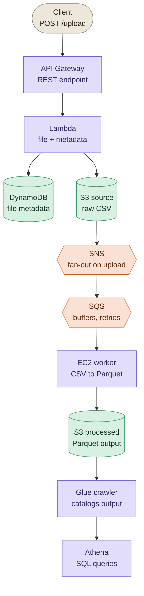

# AWS Serverless File Processor

Upload a CSV, get back a queryable table. This pipeline automatically
converts uploaded CSV files to Parquet and makes them queryable through
Athena, using Lambda, S3, DynamoDB, SNS/SQS, EC2, and AWS Glue — all
provisioned with Terraform.

## Architecture



This pipeline is built around the following components:

- **API Gateway**: REST API endpoint for file uploads
- **Lambda Function**: Handles file uploads and metadata storage
- **S3 Buckets**: Source and destination storage for files
- **DynamoDB**: Metadata storage for uploaded files
- **SNS/SQS**: Event-driven messaging for file processing
- **EC2 Instance**: Processes CSV to Parquet conversion
- **AWS Glue**: Catalogs the processed files, triggered automatically
- **Athena**: Query engine for the cataloged data

## Features

- **Serverless File Upload**: REST API endpoint for uploading files
- **Automatic Format Conversion**: CSV files automatically converted to Parquet
- **Event-Driven Processing**: S3 events drive the pipeline end to end
- **Metadata Tracking**: File metadata stored in DynamoDB
- **Data Cataloging**: AWS Glue crawler runs automatically, no manual trigger
- **Queryable Output**: Processed data is queryable in Athena within about a minute
- **Secure Infrastructure**: Encrypted storage and per-service IAM roles

## Project Structure

```
.
├── aws-infra-tf/               Terraform infrastructure
│   ├── main.tf                 Root module: Glue, Athena, crawler-trigger Lambda
│   └── modules/
│       ├── networking/         VPC, subnet, security group
│       ├── messaging/          SNS topic, SQS queue
│       ├── data/                S3 buckets, DynamoDB table
│       ├── api-gateway/        API Gateway + uploader Lambda
│       └── compute/            EC2 processor + boot script
├── back-end/
│   ├── lambda_function.py             Upload handler
│   └── crawler-trigger/lambda_function.py   Starts the Glue crawler
└── test/                       Sample CSV/Parquet + a quick read check
```

## Prerequisites

- AWS CLI configured with credentials for the target account
- Terraform >= 1.5
- Python 3.8+ with `pandas`/`pyarrow`, only if you want to run `test/test.py`

There's no AWS account ID to configure anywhere — Terraform picks it up
from whatever credentials are active, so this deploys unmodified to any
account.

## Deployment

```bash
cd aws-infra-tf
terraform init
terraform plan  -var-file="variables/dev-modular.tfvars"
terraform apply -var-file="variables/dev-modular.tfvars"
```

Give the EC2 processor a few minutes after `apply` finishes — it's still
installing packages before it starts consuming from SQS.

```bash
terraform output api_gateway_url        # your POST endpoint
terraform output athena_workgroup_name  # select this in the Athena console
terraform output glue_database_name
```

## Usage

```bash
curl -X POST \
  "$(terraform output -raw api_gateway_url)?filename=data.csv" \
  -H 'Content-Type: application/octet-stream' \
  --data-binary @test/data.csv
```

## Processing Flow

1. File uploaded via API Gateway
2. Lambda function stores the file in S3 and writes metadata to DynamoDB
3. S3 event triggers an SNS notification
4. SNS message is sent to an SQS queue
5. EC2 instance processes SQS messages
6. CSV files are converted to Parquet format
7. Processed files are stored in the destination S3 bucket
8. The new file triggers a Lambda that starts the Glue crawler
9. Glue crawler catalogs the data, making it queryable in Athena

## AWS Resources Created

- **S3 Buckets**: 2 buckets for source and processed files, plus one for Athena query results
- **Lambda Functions**: Upload handler and crawler-trigger handler
- **API Gateway**: REST API with a POST endpoint
- **DynamoDB Table**: Metadata storage
- **SNS Topic**: Event notifications
- **SQS Queue**: Message processing
- **EC2 Instance**: Data processing worker
- **VPC**: Isolated network environment
- **IAM Roles**: One per service, scoped to what it needs
- **AWS Glue**: Database and crawler for the data catalog
- **Athena**: Workgroup for querying the cataloged data

## Security Features

- Server-side encryption for S3 buckets and the DynamoDB table (AWS KMS)
- Each Lambda and the EC2 instance run under their own IAM role, scoped to their own service
- EC2 processor runs inside a dedicated VPC with a scoped security group
- No AWS account ID or other account-specific values are hardcoded anywhere in this repo

## Monitoring and Logging

- CloudWatch logs for both Lambda functions
- EC2 processor logs to the systemd journal (`journalctl -u csv-processor`)
- SQS visibility timeout tuned for processing reliability

## Testing

```bash
cd test
python test.py
```

Reads `data.parquet` back into a DataFrame — a quick check that the
pipeline's output is a well-formed Parquet file.

## Cleanup

```bash
cd aws-infra-tf
terraform destroy -var-file="variables/dev-modular.tfvars"
```

## Future Enhancements

- Add support for multiple file formats
- Implement data validation and quality checks
- Add CloudWatch dashboards for monitoring
- Implement dead-letter queues for error handling
- Add an automated testing / CI pipeline
- Move Terraform state to a remote S3 + DynamoDB backend
- Scope IAM policies down to least privilege
- Add CORS support for browser-based uploads
