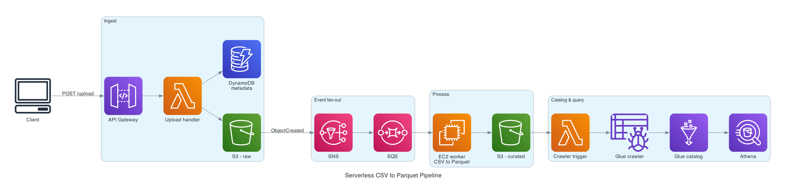

# AWS Serverless File Processor

[](https://www.terraform.io)

Upload a CSV, get back a queryable table. No manual step anywhere between
upload and query.

## Why

Athena bills per byte scanned. CSV can't be read partially — querying two
columns still means scanning the whole row. Parquet splits data by column
and compresses it, so you only pay for the columns you actually query.

This pipeline just automates the conversion so you don't have to remember
to do it: upload a CSV, and it's sitting in Athena as Parquet, cataloged
and ready to query, within about a minute.

## Architecture



*Generated from [`docs/architecture.py`](docs/architecture.py) — run
`python docs/architecture.py` to regenerate after changing the infrastructure.*

- **API Gateway**: REST API endpoint for file uploads
- **Lambda Function**: Handles file uploads and metadata storage
- **S3 Buckets**: Source and destination storage for files
- **DynamoDB**: Metadata storage for uploaded files
- **SNS/SQS**: Event-driven messaging for file processing
- **EC2 Instance**: Processes CSV to Parquet conversion
- **AWS Glue**: Catalogs the processed files, triggered automatically
- **Athena**: Query engine for the cataloged data

## Features

- **Serverless File Upload**: REST API endpoint for uploading files
- **Automatic Format Conversion**: CSV files automatically converted to Parquet
- **Event-Driven Processing**: S3 events drive the pipeline end to end
- **Metadata Tracking**: File metadata stored in DynamoDB
- **Data Cataloging**: AWS Glue crawler runs automatically, no manual trigger
- **Queryable Output**: Processed data is queryable in Athena within about a minute
- **Secure Infrastructure**: Encrypted storage and per-service IAM roles

## How It Works

1. File uploaded via API Gateway
2. Lambda function stores the file in S3 and writes metadata to DynamoDB
3. S3 event triggers an SNS notification
4. SNS message is sent to an SQS queue
5. EC2 instance processes SQS messages
6. CSV files are converted to Parquet format
7. Processed files are stored in the destination S3 bucket
8. The new file triggers a Lambda that starts the Glue crawler
9. Glue crawler catalogs the data, making it queryable in Athena

<details>
<summary>Mermaid version (text, diffable in a PR)</summary>


</details>

## Project Structure

```
.
├── aws-infra-tf/               Terraform infrastructure
│   ├── main.tf                 Root module: Glue, Athena, crawler-trigger Lambda
│   └── modules/
│       ├── networking/         VPC, subnet, security group
│       ├── messaging/          SNS topic, SQS queue
│       ├── data/                S3 buckets, DynamoDB table
│       ├── api-gateway/        API Gateway + uploader Lambda
│       └── compute/            EC2 processor + boot script
├── back-end/
│   ├── lambda_function.py             Upload handler
│   └── crawler-trigger/lambda_function.py   Starts the Glue crawler
├── docs/
│   ├── architecture.py         Diagram source (diagrams / graphviz)
│   └── architecture.png        Generated diagram
└── test/                       Sample CSV/Parquet + a quick read check
```

## Prerequisites

- AWS CLI configured with credentials for the target account
- Terraform >= 1.5
- Python 3.8+ with `pandas`/`pyarrow`, only if you want to run `test/test.py`

There's no AWS account ID to configure anywhere — Terraform picks it up
from whatever credentials are active, so this deploys unmodified to any
account.

## Quick Start

```bash
cd aws-infra-tf
terraform init
terraform plan  -var-file="variables/dev-modular.tfvars"
terraform apply -var-file="variables/dev-modular.tfvars"
```

Give the EC2 processor a few minutes after `apply` finishes — it's still
installing packages before it starts consuming from SQS.

```bash
terraform output api_gateway_url        # your POST endpoint
terraform output athena_workgroup_name  # select this in the Athena console
terraform output glue_database_name
```

## Usage

```bash
curl -X POST \
  "$(terraform output -raw api_gateway_url)?filename=data.csv" \
  -H 'Content-Type: application/octet-stream' \
  --data-binary @test/data.csv
```

## Design Decisions

**Why SNS *and* SQS, rather than S3 notifying the worker directly?**
S3 event notifications have no redelivery. If the worker is restarting when
the event fires, it's gone. SNS gives fan-out for future consumers; SQS
gives durability and retry. The queue is what makes a worker restart safe.

**Why EC2 rather than Lambda for the conversion?**
Parquet conversion loads the file into memory. Lambda caps at 10 GB memory
and 15 minutes, which puts a hard ceiling on input size. EC2 costs more
idle but has no cliff. A Lambda version would be cheaper and would fail on
large files.

**Why a separate Lambda to trigger the crawler?**
Glue crawlers can run on a schedule, but a schedule means either stale data
or wasted runs. Triggering on object creation means the catalog updates only
when there's something new to catalog.

**Why five Terraform modules instead of one root configuration?**
So networking can change without touching messaging. Each module owns one
concern and exposes a narrow interface. It also makes the blast radius of a
mistake smaller.

**Why no account ID anywhere in the repo?**
Terraform reads it from active credentials via `data.aws_caller_identity`.
The config deploys unmodified into any account — no fork-and-edit step, and
nothing account-specific to leak in a public repo.

## AWS Resources Created

- **S3 Buckets**: 2 buckets for source and processed files, plus one for Athena query results
- **Lambda Functions**: Upload handler and crawler-trigger handler
- **API Gateway**: REST API with a POST endpoint
- **DynamoDB Table**: Metadata storage
- **SNS Topic**: Event notifications
- **SQS Queue**: Message processing
- **EC2 Instance**: Data processing worker
- **VPC**: Isolated network environment
- **IAM Roles**: One per service, scoped to what it needs
- **AWS Glue**: Database and crawler for the data catalog
- **Athena**: Workgroup for querying the cataloged data

## Cost

The EC2 worker is the only always-on resource and dominates the bill — on a
`t3.micro` in `us-east-1`, roughly $7.50/month on-demand, or $0 if the
account is still within its 12-month AWS Free Tier window (750 hours/month
of `t2`/`t3.micro` included). Everything else — Lambda, API Gateway, S3,
SQS/SNS, DynamoDB, Glue, Athena — is billed per-request or per-scan and
rounds to a few cents at low volume.

`terraform destroy` removes all of it. Set an AWS billing alarm before your
first `apply`.

## Security Features

- Server-side encryption for S3 buckets and the DynamoDB table (AWS KMS)
- Each Lambda and the EC2 instance run under their own IAM role, scoped to their own service
- EC2 processor runs inside a dedicated VPC with a scoped security group
- No AWS account ID or other account-specific values are hardcoded anywhere in this repo

## Monitoring and Logging

- CloudWatch logs for both Lambda functions
- EC2 processor logs to the systemd journal (`journalctl -u csv-processor`)
- SQS visibility timeout tuned for processing reliability

## Testing

```bash
cd test
python test.py
```

Reads `data.parquet` back into a DataFrame — a quick check that the
pipeline's output is a well-formed Parquet file.

## Cleanup

```bash
cd aws-infra-tf
terraform destroy -var-file="variables/dev-modular.tfvars"
```

## Honest Status

The gaps, stated here rather than left to be discovered.

- **App IAM roles are per-service but not least-privilege.** The Lambda,
  EC2, and Glue roles are scoped by service, not by action (`Resource: "*"`
  within each). The CI role is scoped more tightly — see `RUNBOOK.md`.
- **No dead-letter queue.** A repeatedly failing message retries until it
  expires rather than being quarantined for inspection.
- **The worker is a single instance.** Under sustained load the queue grows
  unbounded; nothing autoscales.
- **No security scanning in CI.** `fmt`/`validate` run on every PR, but
  nothing checks for Terraform misconfigurations or vulnerable Python
  dependencies yet.
- **Tested manually, not automatically.** `RUNBOOK.md` gives a repeatable
  validation checklist, but nothing runs it in CI — an end-to-end pass
  still has to be triggered by a person.
- **Glue can create a table scoped to a single file instead of a folder**
  when multiple uploads have different schemas, which makes that table
  return zero rows from Athena with no error. See `RUNBOOK.md` regression
  #3 for the detection steps; the real fix is giving each dataset its own
  S3 subfolder.
